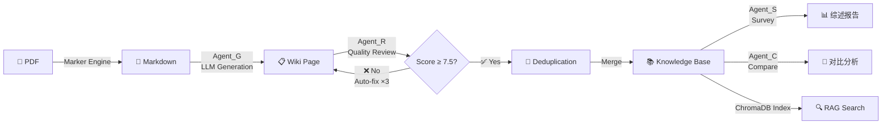
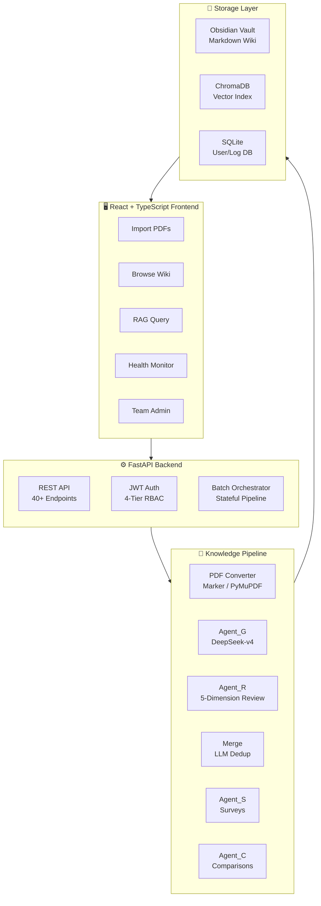
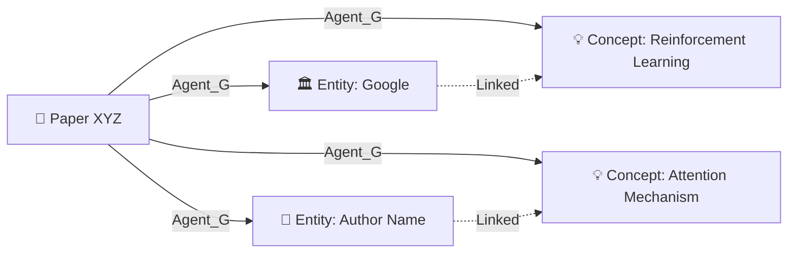
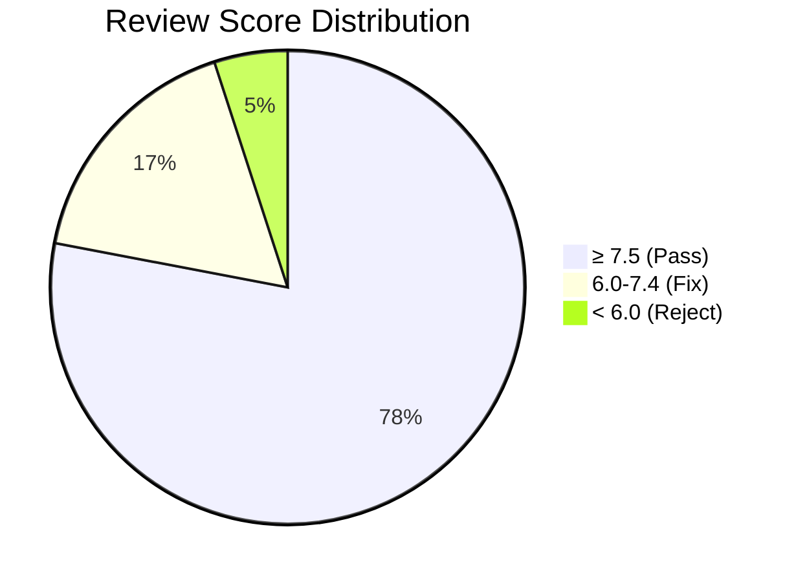
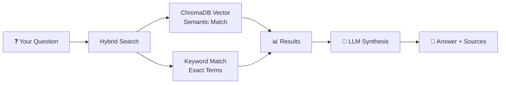

<p align="center">
  
  
  
  
  
</p>

<h1 align="center">LLM-Wiki</h1>
<h3 align="center">Your Personal AI Knowledge Compiler</h3>

<p align="center">
  <b>Turn research papers into a living, queryable knowledge graph — <i>automatically</i>.</b>
</p>

<p align="center">
  Inspired by <a href="https://x.com/karpathy">Andrej Karpathy's</a> LLM-Wiki vision: <br/>
  <i>"An LLM that reads every paper and builds a structured, contradiction-aware knowledge base."</i>
</p>

---

## Why LLM-Wiki?

> Reading papers is easy. **Remembering them** is hard. Connecting ideas across hundreds of papers? Nearly impossible.

LLM-Wiki solves this. Drop in a PDF — it **reads, structures, reviews, and deduplicates** the knowledge into a semantic wiki. No more lost insights. No more conflicting notes. Just a clean, searchable brain for your research.



---

## Architecture at a Glance

LLM-Wiki is built as a **pipeline compiler** — not just a chatbot that summarizes PDFs. Every paper goes through a rigorous 4-stage pipeline before entering your knowledge base.



### The Pipeline: Deeper Than It Looks

| Stage | What Happens | Why It Matters |
|-------|-------------|----------------|
| **1. PDF → Markdown** | Extracts text, formulas, tables, images via Marker engine | Preserves mathematical content (KaTeX) and visual data |
| **2. Agent_G Generate** | LLM generates 5 page types: Paper, Entity, Concept, Summary, Synthesis | Extracts not just "what the paper says" but *who, what concepts, and how they connect* |
| **3. Agent_R Review** | 4-dimension scoring: Completeness, Accuracy, Structure, Readability | Every page must score ≥ 7.5/10 or auto-retry (up to 3 fix cycles) |
| **4. Merge Dedup** | LLM-powered entity/concept deduplication with similarity scoring | New papers enrich existing knowledge instead of fragmenting it |
| **5. Agent_S Survey** | LLM generates comprehensive survey reports from multiple documents | Custom prompt support + self-evaluation with auto-retry below 7.5 |
| **6. Agent_C Compare** | LLM generates multi-document comparison analyses with tables | Side-by-side comparison of datasets, methods, architectures — exportable as PDF |

---

## Features That Make LLM-Wiki Different

### 🔬 **Pipeline, Not Just Chat**

Most AI tools give you a chat window and a PDF. LLM-Wiki runs a **stateful, retry-capable batch pipeline** — process 100 papers while you sleep, with every page quality-checked.

### 🧠 **Entity & Concept Extraction**

Beyond paper summaries, LLM-Wiki automatically extracts:
- **Entities**: People, organizations, technologies, projects mentioned in the paper
- **Concepts**: Abstract ideas, methods, frameworks — cross-linked across papers



### 🔗 **Automatic Deduplication**

Upload a paper about BERT? LLM-Wiki won't create a duplicate "BERT" entity — it merges new insights into the existing entry. Your knowledge graph grows smarter, not messier.

### ✅ **Built-in Quality Control**



Every generated page is independently scored on 5 dimensions. Substandard pages are auto-fixed before entering your wiki. No garbage in, no garbage out.

### 🩺 **System Health Check**

A built-in "linter" for your knowledge base:

```
$ python scripts/lint.py
📊 Wiki Health Report
├── Total Pages: 847
├── Orphan Pages (no cross-links): 12 ⚠️
├── Broken Internal Links: 3 ❌
├── Incomplete Papers (missing sections): 5 ⚠️
└── Duplicate Entities (pending merge): 8 📋
```

### 🔍 **RAG-Powered Semantic Search**



Ask questions in natural language. Get answers grounded in your actual knowledge base — with source citations.

### 👥 **Team Collaboration**

```
Role Hierarchy:
  admin ─── maintainer ─── core ─── general
  
admin:       Full system control
maintainer:  Content management + user admin
core:        Generate, edit, review content
general:     Browse and search (read-only)
```

### 🔒 **Production-Ready Security**

- JWT token authentication with expiry
- Role-based access control (4 tiers)
- Path traversal protection (`_safe_path`)
- Atomic file writes (write-to-tmp-then-rename)
- Rate limiting on login endpoints

---

## Tech Stack

<p align="center">
  
</p>

| Layer | Technology | Why |
|-------|-----------|-----|
| **Backend** | FastAPI + Python 3.10+ | Async-first, auto-generated Swagger docs |
| **Frontend** | React 18 + TypeScript + Vite | Type-safe, HMR, modern DX |
| **UI Framework** | Ant Design 5 + CSS Variables | Polished components, dark mode native |
| **State** | Zustand + TanStack Query | Minimal boilerplate, smart caching |
| **LLM** | DeepSeek-V3 / V4 (configurable) | Cost-effective, 8K+ context, strong reasoning |
| **Vector DB** | ChromaDB (embedded) | Zero-config, SQLite-backed, no external service |
| **Storage** | SQLite + Obsidian Vault (Markdown) | Human-readable, Git-friendly, portable |
| **PDF** | Marker / PyMuPDF | Formula + table + image extraction |

---

## Quick Start

```bash
# 1. Clone
git clone https://github.com/ceasarboy/llm-wiki.git
cd llm-wiki

# 2. Configure
cp config.example.yaml config.yaml
# Edit config.yaml: set your API key (DeepSeek or OpenAI-compatible)
# Set your paths: vault_root, wiki_dir, raw_dir

# 3. Install & Run (One-click)
start-dev.bat

# 4. Open browser
# Frontend: http://localhost:5173
# API Docs: http://localhost:8000/docs
```

### Manual Setup

```bash
# Backend
pip install -r requirements.txt
uvicorn api.main:app --host 0.0.0.0 --port 8000 --reload

# Frontend
cd web
npm install
npm run dev
```

---

## Project Structure

```
llm-wiki/
├── api/                # FastAPI backend
│   ├── middleware/     # JWT auth, RBAC
│   ├── routers/        # Auth, Users, Logs endpoints
│   ├── models/         # User, Log ORM models
│   ├── schemas/        # Pydantic validation
│   └── services/       # Business logic
├── scripts/            # Knowledge pipeline
│   ├── agent_g.py      # LLM page generator
│   ├── review.py       # Agent_R quality reviewer
│   ├── merge.py        # Entity deduplication
│   ├── batch.py        # Batch orchestrator
│   ├── lint.py         # System health check
│   └── pdf_converter.py# PDF to Markdown
├── web/                # React frontend
│   └── src/pages/      # 15 feature pages
├── templates/          # Wiki page templates
├── docs/               # Full documentation
│   ├── architecture.md # System architecture
│   ├── api-reference.md# API business docs
│   └── deployment.md   # Deployment guide
└── config.example.yaml # Configuration template
```

---

## Who Is This For?

| You Are... | LLM-Wiki Helps You... |
|-----------|----------------------|
| 🔬 **Researcher / PhD Student** | Build a personal knowledge graph from papers you read. Never lose an insight again. |
| 🏢 **R&D Team Lead** | Centralize your team's literature review. Everyone builds on shared knowledge. |
| 📚 **Knowledge Manager** | Turn scattered PDFs into a structured, queryable wiki with version history. |
| 🤖 **AI / MLOps Engineer** | Self-host your own RAG knowledge base with full control over the pipeline. |

---

## Roadmap (V2)

- [ ] **Knowledge Graph Visualization** — Interactive D3.js force-directed graph of entities & concepts
- [ ] **Multi-LLM Support** — OpenAI, Claude, local Ollama models
- [ ] **Citation Network Analysis** — Which papers cite which, key influence paths
- [ ] **Conflict Resolution Dashboard** — Visual diff for contradictory claims across papers
- [ ] **Plugin System** — Custom Agent_G / Agent_R plugins for domain-specific processing
- [ ] **Docker Deployment** — One-container deployment with docker-compose

---

## Documentation

| Document | Description |
|----------|-------------|
| [Architecture](docs/architecture.md) | System design, pipeline flow, module dependencies |
| [API Reference](docs/api-reference.md) | 40+ endpoints with business semantics |
| [Deployment Guide](docs/deployment.md) | Environment setup, troubleshooting, production checklist |
| [User Manual](docs/使用说明书.md) | Step-by-step usage guide (Chinese) |
| [V1 Review Report](docs/superpowers/reviews/v1-architecture-review.md) | Architecture audit & improvement plan |

---

## Contributing

Contributions are welcome! LLM-Wiki follows an **ACP (Agile Capability Process)** with defined roles:

- **Architect** — System design & requirements
- **Developer** — Feature implementation
- **Reviewer** — Code & content review
- **Tester** — Quality assurance

Check our [CLAUDE.md](CLAUDE.md) for agent behavior specifications.

---

## License

MIT © [ceasarboy](https://github.com/ceasarboy)

---

<p align="center">
  <b>⭐ Star this repo if you find it useful!</b><br/>
  <sub>Built with ❤️ for researchers who read too many papers.</sub>
</p>
