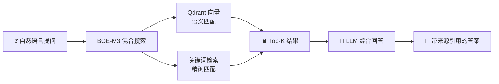
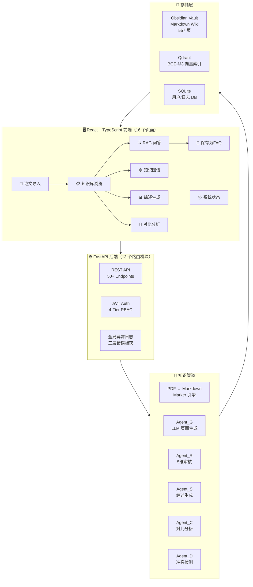

<p align="center">
  
  
  
  
  
</p>

<h1 align="center">个人Wiki知识库</h1>
<h3 align="center">让知识沉淀、复用、迭代，构建高效、富有生命力的智能知识系统。</h3>

<p align="center">
  <b>将 PDF 论文自动转化为结构化、可追溯、可检索的知识图谱 — <i>全自动</i>。</b>
</p>

<p align="center">
  灵感来源：<a href="https://x.com/karpathy">Andrej Karpathy</a> 的 LLM-Wiki 愿景 <br/>
  <i>"An LLM that reads every paper and builds a structured, contradiction-aware knowledge base."</i>
</p>

---

## 为什么需要这个系统？

> 读论文容易，**记住论文**难。把上百篇论文串联起来？几乎不可能。

本系统解决这个痛点。丢入一篇 PDF — 它会**读、结构化、审查、去重**知识，存入语义 Wiki。不再丢失洞察，不再有笔记冲突。一个干净、可搜索的个人研究大脑。

---

## 快速开始

```bash
# 1. 克隆
git clone https://github.com/ceasarboy/llm-wiki.git
cd llm-wiki

# 2. 配置
cp config.example.yaml config.yaml
# 编辑 config.yaml：设置 API key（DeepSeek 或 OpenAI 兼容接口）
# 设置路径：vault_root, wiki_dir, raw_dir

# 3. 一键启动
start-dev.bat

# 4. 打开浏览器
# 前端：http://localhost:5173
# API 文档：http://localhost:8000/docs
```

---

## V2 核心亮点

### 🔍 智能检索 — 混合搜索 + RAG 问答



- **BGE-M3 嵌入模型**：1024 维向量，支持中英文混合检索
- **混合搜索**：语义相似度 + 关键词精确匹配，Top-K 融合去重
- **来源追溯**：每条答案自动附带 wiki 页面引用，可点击跳转
- **问答保存**：一键将 Q&A 保存为 FAQ 页面，积累个人知识库

### 📊 综述生成（Agent-S）

输入一个研究主题 → 自动检索相关论文/实体/概念 → LLM 生成结构化综述报告，含时间线、技术突破、SOTA 对比、开放问题四个维度。每条事实可溯源。

### 🔬 对比分析（Agent-C）

选择 2+ 篇论文 → 逐维度对比实验数据、方法论、适用场景 → 生成对比矩阵。支持导出。

### 🕸️ 知识图谱可视化

交互式 D3.js 力导向图，展示实体/概念/论文之间的关联。支持拖拽、缩放、节点展开、类型筛选。

### ⚔️ 冲突检测（Agent-D）

自动扫描同主题页面 → LLM 逐对分析是否存在事实矛盾 → 自动写入 `[Conflict: ...]` 标记。前端 StatusPage 提供冲突面板，支持筛选和修复。

### 🔗 引用追溯

`citation_tracer.py` — 提取所有 `[Source:]` 和 `[[wikilinks]]`，构建引用关系图。支持 `build`（构建图 JSON）、`trace`（追溯引用链）、`top`（最高引用页面）。

### 📚 自动 FAQ 生成

从现有 Wiki 页面（概念/实体/论文）自动提取关键信息 → 生成 FAQ 问答对。采用 Obsidian 标准格式（无 YAML Frontmatter、`[Source:]` 标签、`[[双向链接]]`）。

### 🩺 全局异常日志

三层错误捕获：HTTP 中间件（记录 4xx/5xx）+ 全局异常处理器（记录未捕获异常）+ 端点级日志。所有错误写入数据库，前端 StatusPage 可实时查看。

---

## PDF 转换器选型说明

> ⚠️ **重要提示**：Marker 是本系统 PDF 转换的核心引擎，转换速度较慢（单论文分钟级），但精度不可替代。

### 尝试过的替代方案

| 方案 | 结果 | 原因 |
|------|------|------|
| **OpenDataLoader Hybrid** | ❌ 不采用 | Fast 模式无 LaTeX 公式；Formula 增强需 GPU，CPU 上 `std::bad_alloc` |
| **Microsoft MarkItDown** | ❌ 不采用 | 基于 pdfminer.six 的纯文本提取，无公式、无布局识别、无 AI 组件 |
| **PyMuPDF (fitz)** | ⚠️ 仅备份 | 只能提取纯文本，无格式保留；用作紧急恢复方案，非首选 |

### 为什么 Marker 不可替代

| 能力 | Marker | 其他方案 |
|------|--------|----------|
| LaTeX 公式提取 | ✅ `$$\mathbf{}$$` | ❌ 全不支持 |
| 引用链接 | ✅ 可点击 `(Author, 2024)` | ❌ 纯文本 |
| 页锚定位 | ✅ `<span id="page-X-Y">` | ❌ 无 |
| 表格结构 | ✅ 结构良好 | ⚠️ 仅部分方案支持 |

### 建议

- **单篇即时转换**：直接使用 Marker（前端上传，等待完成）
- **批量转换**：计划在 V3 加入定时任务，利用夜间时段批量处理（见 Roadmap）

---

## 系统架构



---

## 技术栈

| 层 | 技术 | 说明 |
|------|------|------|
| **后端** | FastAPI + Python 3.10+ | 异步优先，自动生成 Swagger 文档 |
| **前端** | React 18 + TypeScript + Vite | 类型安全，HMR 热更新 |
| **UI 框架** | Ant Design 5 + CSS 变量 | 完善组件库，暗色模式原生支持 |
| **状态管理** | Zustand + TanStack Query | 低样板代码，智能缓存 |
| **LLM** | DeepSeek-V3/V4（可配置） | 高性价比，强推理能力，支持中文 |
| **向量数据库** | Qdrant（嵌入式） | BGE-M3 索引，混合搜索 |
| **嵌入模型** | BAAI/bge-m3 | 1024 维，中英文混合，本地缓存 |
| **存储** | SQLite + Obsidian Vault (Markdown) | 人类可读，Git 友好，可移植 |
| **PDF 转换** | Marker | 公式/表格/图片全提取（较慢，V3 加入定时批量） |

---

## 项目结构

```
llm-wiki/
├── api/                    # FastAPI 后端
│   ├── main.py             # 应用入口 + 全局异常日志
│   ├── routers/            # 13 个路由模块（pages/pdf/search/graph/synthesis...）
│   ├── models/             # ORM 模型（User/Log/SystemLog）
│   ├── schemas/            # Pydantic 校验
│   ├── services/           # 业务逻辑（auth/log_service）
│   └── middleware/         # JWT + RBAC 中间件
├── scripts/                # 知识管道
│   ├── agent_g.py          # Agent-G: LLM 页面生成
│   ├── review.py           # Agent-R: 5维质量审核
│   ├── merge.py            # 实体/概念去重融合
│   ├── survey.py           # Agent-S: 综述生成
│   ├── compare.py          # Agent-C: 对比分析
│   ├── conflict_detector.py# Agent-D: 冲突检测
│   ├── citation_tracer.py  # 引用追溯（build/trace/top）
│   ├── gen_faqs.py         # 自动 FAQ 生成
│   ├── embedding_bge.py    # BGE-M3 嵌入（离线+镜像兜底）
│   ├── batch.py            # 批量处理编排
│   ├── lint.py             # 系统健康体检
│   └── pdf_converter.py    # Marker PDF 转换
├── web/                    # React 前端
│   └── src/pages/          # 16 个功能页面
├── templates/              # Wiki 页面模板
├── docs/                   # 完整文档
│   ├── architecture.md     # 系统架构
│   ├── api-reference.md    # API 业务语义
│   ├── deployment.md       # 部署指南
│   ├── V2-development-plan.md  # V2 开发计划
│   └── V3-development-plan.md  # V3 蓝图
└── config.example.yaml     # 配置模板
```

---

## Roadmap

### V2.3（当前版本）
- [x] 知识图谱可视化（D3.js）
- [x] 综述生成 + 对比分析
- [x] 冲突检测（Agent-D）
- [x] 引用追溯（citation_tracer）
- [x] 自动 FAQ 生成（50 条）
- [x] 全局异常日志
- [x] 知识库分页（50条/页）

### V3（规划中）
- [ ] **批量转换定时任务** — 利用夜间时段自动批量 PDF → Markdown 转换，解决 Marker 慢速问题
- [ ] Agent 引擎 — 零依赖自建 Agent 框架
- [ ] LiteratureReviewer — 文献审查 Agent
- [ ] Agent 矩阵 — 6 个专用 Agent
- [ ] Agent 自学习 — 元记忆系统
- [ ] 语义索引生成
- [ ] 知识过期检测

---

## 谁适合使用？

| 你是谁... | 本系统能帮你... |
|-----------|----------------|
| 🔬 **研究者 / 博士生** | 从读过的论文构建个人知识图谱，不再丢失任何洞察 |
| 🏢 **研发团队主管** | 集中团队的文献审查，所有人共建共享知识 |
| 📚 **知识管理者** | 将散乱的 PDF 转化为结构化、可查询的 Wiki |
| 🤖 **AI / MLOps 工程师** | 自部署 RAG 知识库，完全掌控管道 |

---

## 文档索引

| 文档 | 描述 |
|------|------|
| [系统架构](docs/architecture.md) | 系统设计、管道流程、模块依赖 |
| [API 参考](docs/api-reference.md) | 50+ 端点业务语义 |
| [部署指南](docs/deployment.md) | 环境搭建、故障排除、生产检查清单 |
| [使用说明](docs/使用说明书.md) | 逐步操作指南 |
| [V2 开发计划](docs/V2-development-plan.md) | V2 5 个迭代详情与完成度 |
| [V3 开发蓝图](docs/V3-development-plan.md) | V3 4 个阶段规划 |

---

## 贡献

欢迎贡献！本系统遵循 **ACP（敏捷开发流程）**，设有以下角色：

- **架构师** — 系统设计与需求
- **开发者** — 功能实现
- **审查者** — 代码与内容审查
- **测试者** — 质量保证

详见 [CLAUDE.md](CLAUDE.md) 了解 Agent 行为规范。

---

## License

MIT © [ceasarboy](https://github.com/ceasarboy)

---

<p align="center">
  <b>⭐ 如果这个项目对你有用，请 Star！</b><br/>
  <sub>为读了太多论文的研究者而建 ❤️</sub>
</p>