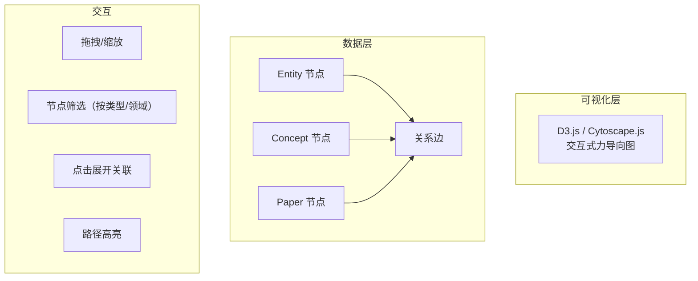
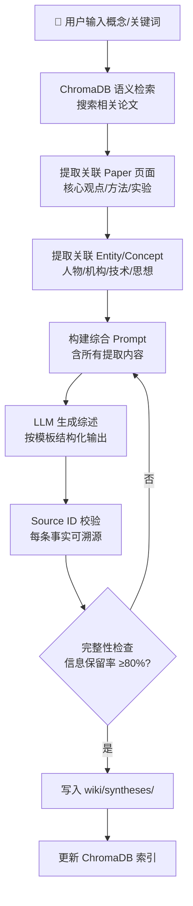
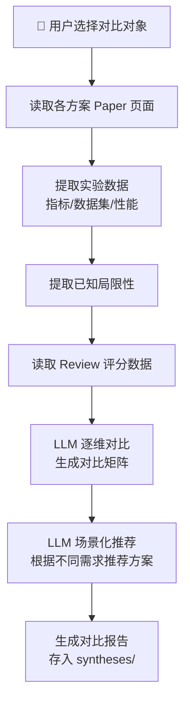

# LLM-Wiki V2 需求分析文档

> **版本**: V2  
> **创建日期**: 2026-05-04  
> **来源**: V1 架构审查报告 + 用户需求讨论  
> **定位**: 以 Wiki 为核心，从"单篇处理"升级为"多篇综合与对比"

---

## 一、V2 核心定位

### 一句话描述

> 从"单篇论文处理"升级为"多篇论文的综合与对比"——让知识库能自己写出综述。

### 与 V1 的关系

```
V1: 单篇论文 → 结构化 Wiki 页面（完成）
V2: 多篇论文 → 综述 / 对比 / 可视化（本次）
V3: 知识库 → Agent 的记忆基础设施（蓝图）
```

### 竞品对标

| 能力 | Google NotebookLM | LLM-Wiki V2 优势 |
|------|-------------------|-------------------|
| 多文档输入 | 用户手动上传 | 知识库自动关联 |
| 溯源能力 | 引用原文段落 | Source ID 精确到文件 |
| 持久化 | 会话内，不保存 | 存入 wiki/syntheses，可被后续检索 |
| 去重整合 | 无 | 自动融合到已有实体/概念 |
| 质量审核 | 无 | 可选走 Agent_R 审核 |

---

## 二、功能性需求

### 2.1 P0：综述生成 (Survey Synthesis)

**目标用户场景**：研究人员想快速了解一个技术方向的全貌。

**输入**：用户选定一个 Concept 或技术方向关键词（如 "Chiplet 3D 集成"）

**系统行为**：

```
用户选择概念 → 系统检索关联论文 → 提取核心信息 → LLM 生成综述 → 存入 synthesis 页面
```

**输出内容要求**：

| 章节 | 内容 | 来源 |
|------|------|------|
| 时间线 | 该方向的演进历史，标注关键论文和时间节点 | Paper 页面 |
| 关键突破 | 里程碑论文及其贡献，含数据支撑 | Paper 实验章节 |
| 当前 SOTA | 目前最先进的方法和结果 | Paper 结论 |
| 开放问题 | 尚未解决的挑战 | 跨论文综合分析 |
| 相关实体 | 该方向的关键人物、机构、技术 | Entity 页面 |
| 参考文献 | 带 Source ID 的引用列表 | 系统自动生成 |

**约束**：
- 每条事实性陈述必须标注 Source ID
- 信息保留率 ≥80%（不能过度摘要）
- 输出为标准 synthesis 页面格式，存入 `wiki/syntheses/`

---

### 2.2 P0：对比分析 (Comparison Matrix)

**目标用户场景**：技术选型时需要对比不同方案，做出决策。

**输入**：用户选定 2+ 个竞争技术路线（如 "Marker vs PyMuPDF vs MinerU PDF 提取方案"）

**系统行为**：

```
用户选择对比对象 → 各方案信息采集 → 逐维对比 → LLM 综合分析 → 生成对比报告
```

**输出结构**：

```
1. 对比矩阵（表格）
   Row: 对比维度（准确性/速度/公式支持/表格支持/图片保留/多语言...）
   Col: 各方案
   Cell: 评分 + 依据

2. 方案详述
   - 每个方案的原理简述
   - 独特优势
   - 已知局限性

3. 场景化建议
   - "场景A（需要精确公式）→ 选 X"
   - "场景B（批量快速处理）→ 选 Y"
   - "场景C（多语言混合）→ 选 Z"

4. Source 溯源
```

**对比维度的提取策略**：
1. 从 Paper 的实验验证章节自动提取可比指标
2. 从 Review 数据中提取已有评分
3. 让 LLM 补充领域常用的评估维度
4. 用户可自定义额外维度

---

### 2.3 P1：知识图谱可视化

**目标用户场景**：直观了解知识库中论文、实体、概念之间的关联。

**核心能力**：



**功能点**：

| 功能 | 说明 |
|------|------|
| 全量图谱 | 展示所有实体/概念/论文的关系网络 |
| 按领域筛选 | 只显示特定研究方向的知识图谱 |
| 实体聚焦 | 选中一个实体，高亮所有关联 |
| 关系筛选 | 只看某类关系（如"属于同一概念"） |
| 路径追溯 | 从论文A到论文B经过哪些实体/概念 |
| 导出 | 导出 PNG/SVG，用于论文配图 |

**技术选型建议**：
- 渲染引擎：D3.js（灵活性强）或 Cytoscape.js（开箱即用）
- 后端只提供数据 API：`/api/graph/nodes` + `/api/graph/edges`
- 前端独立组件：`KnowledgeGraph.tsx`

---

### 2.4 P1：冲突发现面板

**目标用户场景**：发现知识库中互相矛盾的研究结论，识别需要核实的高风险区域。

**核心能力**：

```
定时/手动扫描知识库 → 逐对比较同主题论文的结论 → LLM 判断是否存在矛盾 → 生成冲突清单
```

**输出**：

```markdown
## 冲突报告

### 冲突 #1: 3D IC 热管理的有效方法
- **论文A** (2301.12252): "微通道冷却可将热点温度降低 40%"
- **论文B** (2406.00858): "微通道冷却在 3D 堆叠中的效果有限，仅 15-20%"
- **判断**: 实验条件差异（堆叠层数不同），需标注使用条件
- **建议**: 在 Concept 页面补充条件说明

### 冲突 #2: ...
```

**约束**：
- 只标记疑似冲突，不自动修改页面
- 冲突标记存为 `[Conflict: ...]` 格式，符合 CLAUDE.md 规范
- 面板支持：查看、筛选、已解决标记、忽略

---

### 2.5 P2：Citation 关系追溯

**功能**：追溯论文之间的引用链，发现知识传播路径。

- 输入一篇论文，展示其引用链（谁引了它、它引了谁）
- 识别"种子论文"（被引用最多的几篇）
- 识别"孤立论文"（无引用的论文）

### 2.6 P2：语义化索引生成

**功能**：自动生成按研究方向分组的分类索引页，替代手动维护的 index.md。

- 按 Concept 分组论文
- 按时间分组（2020前/2020-2023/2023后）
- 按实体分组（同作者/同机构）

### 2.7 P2：知识过期检测

**功能**：新入库论文是否推翻/修正了已有结论，自动标记待更新页面。

---

## 三、非功能性需求（来自 V1 审查报告）

### 3.1 代码质量

| # | 改进项 | V1 评分 | V2 目标 |
|---|--------|---------|---------|
| 1 | 拆分 main.py 为多个 Router | 6.5→ | 8.0 |
| 2 | 前端 token 提取逻辑去重 | — | 完成 |
| 3 | call_llm 增加指数退避重试 | — | 完成 |
| 4 | 统一代码风格（datetime/配置） | — | 完成 |

### 3.2 架构优化

| # | 改进项 | V1 评分 | V2 目标 |
|---|--------|---------|---------|
| 1 | 管道脚本模块化（subprocess→函数调用） | 7.5→ | 8.5 |
| 2 | VaultIndex 增量更新 | — | 完成 |
| 3 | ChromaDB 与 Wiki 一致性保障 | — | 加校验 |

### 3.3 安全性

| # | 改进项 |
|---|--------|
| 1 | 添加 PDF 上传大小限制 |
| 2 | 日志中敏感字段过滤 |
| 3 | Token 存储改为 httpOnly cookie（生产环境） |

### 3.4 可靠性

| # | 改进项 |
|---|--------|
| 1 | 健康检查自动化定时运行 |
| 2 | ChromaDB 可用性检测 + 一键重建 |
| 3 | 引入 Alembic 数据库迁移 |

### 3.5 文档

| # | 改进项 |
|---|--------|
| 1 | 补充 API 请求/响应示例 |
| 2 | 补充 Docker 部署方案 |
| 3 | 补充运行时架构说明 |

---

## 四、数据流设计

### 4.1 综述生成数据流



### 4.2 对比分析数据流



---

## 五、验收标准

| 功能 | 验收标准 |
|------|----------|
| 综述生成 | 输入一个概念，2 分钟内生成含 ≥80% 信息保留率的综述，所有事实可溯源 |
| 对比分析 | 输入 2+ 方案，生成完整的对比矩阵 + 场景化建议 |
| 图谱可视化 | 页面加载 3 秒内渲染完成，支持至少 3 种交互操作 |
| 冲突发现 | 自动扫描发现 ≥90% 的同主题矛盾结论 |
| 代码重构 | main.py 拆分后每个 Router ≤300 行，call_llm 重试成功率提升 |
| 安全加固 | 上传限制生效，敏感字段不出现在日志中 |

---

*本文档基于 V1 架构审查报告（docs/superpowers/reviews/v1-architecture-review.md）和 2026-05-04 用户需求讨论整理。*
