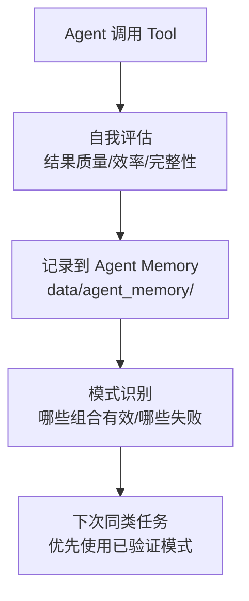

# LLM-Wiki V3 开发计划（蓝图级）

> **版本**: V3  
> **创建日期**: 2026-05-04  
> **参考文档**: V3-requirements.md  
> **定位**: 蓝图级计划，具体任务在 V2 收尾后细化  
> **开发方式**: ACP（敏捷开发）

---

## 一、V3 分阶段路线

V3 的核心挑战是**架构升级**而非功能堆砌。因此采用"基础设施先行、Agent 逐类型上线"的策略。

```
Phase 3.1: 基础设施层（地基）
Phase 3.2: 首个 Agent 上线（验证）
Phase 3.3: Agent 矩阵（规模化）
Phase 3.4: Agent 自学习（V3 杀手功能）
```

---

## 二、Phase 3.1：基础设施层

> 目标：搭建 Agent 运行的基础设施，不影响任何 V2 功能。

### 核心模块

| 模块 | 文件 | 估计 | 依赖 |
|------|------|------|------|
| Agent 引擎 | `scripts/agent.py` | 3h | call_llm |
| Tool 注册表 | `scripts/tools.py` | 2h | 封装现有能力 |
| 记忆管理器 | `scripts/memory.py` | 3h | 文件系统 + SQLite |
| 用户偏好表 | `api/models/user_profile.py` | 1h | SQLAlchemy |
| 会话存储 | `data/sessions/` | 0.5h | 文件系统 |
| Agent 记忆目录 | `data/agent_memory/` | 0.5h | 文件系统 |

### 不碰的部分
- V2 所有页面和 API — 只读不做任何修改
- V2 前端页面 — 不加 Agent 入口
- 现有用户认证系统 — 复用

### 验收标准
- [ ] `Agent.run("搜索Chiplet热管理的最新论文")` 返回结果含 Source ID
- [ ] 跨两次调用，Agent 能读取到上一轮的 session 记忆
- [ ] Tool 注册表中至少注册了 6 个可用 Tool

---

## 三、Phase 3.2：首个 Agent 上线（LiteratureReviewer）

> 目标：选择最成熟的场景（文献审查）作为首发 Agent，验证架构。

### 任务清单

| ID | 任务 | 描述 | 估计 |
|----|------|------|------|
| V3-3.2.1 | LiteratureReviewer System Prompt | 设计并调优文献审查 Agent 的系统提示 | 1h |
| V3-3.2.2 | 审查报告模板 | 定义审查报告的结构（方法论评价/证据等级/空白发现） | 0.5h |
| V3-3.2.3 | Agent 对话 API | `POST /api/agent/chat` — 接收消息，返回 Agent 响应 + tool_calls 日志 | 1.5h |
| V3-3.2.4 | WebSocket 支持（可选） | 流式输出 Agent 思考和工具调用过程 | 2h |
| V3-3.2.5 | 前端 AgentChat 页面 | 对话界面：Markdown 渲染 + Source 高亮 + 工具调用折叠面板 | 4h |
| V3-3.2.6 | 对话→Wiki 保存 | Agent 输出一键保存为 synthesis 页面 | 1h |

### 验收标准
- [ ] "审查知识库中 Chiplet 相关的所有论文" → Agent 自动检索 → 逐个分析 → 生成审查报告
- [ ] 报告中每个主张可点击溯源到原始页面
- [ ] 整个流程在 5 分钟内完成

---

## 四、Phase 3.3：Agent 矩阵（规模化）

> 目标：在验证了 Agent 架构后，快速上线其余 Agent 类型。

### Agent 上线顺序

| 顺序 | Agent | 理由 |
|------|-------|------|
| 1 | LiteratureReviewer | 场景最成熟，与 V1/V2 核心流程最契合 |
| 2 | ResearchExplorer | 比 LiteratureReviewer 多一点推理，但工具相似 |
| 3 | CompetitorAnalyst | 与 V2 对比分析功能呼应 |
| 4 | ProductPlanner | 需要新的输出格式（PRD），需要模板设计 |
| 5 | WritingAssistant | 工具链路最长（检索→提取→组织→引用） |
| 6 | Teacher | 交互性最强，可能需要多轮对话优化 |

### 每 Agent 估计工作量: 1-2 天（主要是 System Prompt 调优）

### 验收标准
- [ ] 每个 Agent 类型能独立完成其定义的核心任务
- [ ] Agent 选择器：用户描述需求 → 系统自动匹配最佳 Agent

---

## 五、Phase 3.4：Agent 自学习（V3 杀手功能）

> 目标：实现 Agent 的"元记忆"——让 Agent 从自己的成功和失败中学习。

### 核心机制



### 任务清单

| ID | 任务 | 描述 | 估计 |
|----|------|------|------|
| V3-3.4.1 | 自动评估器 | 每次 Tool 调用后，让 LLM 自我评估：是否达到目的、哪里可以改进 | 2h |
| V3-3.4.2 | 经验持久化 | 评估结果写入结构化 MD 文件，按 Tool/领域 分类 | 1h |
| V3-3.4.3 | 经验检索 | 新任务开始时，先查是否有相关的历史经验 | 1h |
| V3-3.4.4 | 失败模式库 | 累计 3 次同类失败 → 自动生成"能力边界"声明 | 1h |
| V3-3.4.5 | 工具组合推荐 | 基于历史成功案例，对特定任务推荐 Tool 组合 | 1h |

### 验收标准
- [ ] Agent 执行同类任务第 5 次时，效率明显优于第 1 次
- [ ] 查看 `data/agent_memory/tools/*.md` 能看到实际积累的经验
- [ ] Agent 遇到已知的失败模式时，主动告知用户而非盲目重试

---

## 六、V3 技术决策记录

| 决策 | 选择 | 不选 | 理由 |
|------|------|------|------|
| Agent 框架 | **自建**（零依赖） | LangChain/LangGraph/CrewAI | 场景具体，自建更快更可控 |
| Tool 协议 | **OpenAI function calling 格式** | 自定义格式 | 与 DeepSeek 兼容，未来换模型无障碍 |
| 状态管理 | **AgentState dataclass** | LangGraph StateGraph | 不到 50 行，不需要框架 |
| 会话存储 | **MD 文件** | Redis/数据库 | 人类可读、可 Git 追踪、零运维 |
| 记忆检索 | **ChromaDB 复用** | 新建独立向量库 | 知识检索和记忆检索同一个引擎 |

---

## 七、外部依赖清单（V3 新增）

```
# V3 不新增任何 PyPI 依赖！
# 全部使用 Python 标准库 + 已有依赖
```

**V3 新增代码文件**:

```
scripts/
├── agent.py          # Agent 核心引擎 (~200行)
├── tools.py          # Tool 注册表 + 12个Tool (~200行)
└── memory.py         # 记忆管理器 (~300行)

api/
├── models/user_profile.py   # 用户偏好 ORM
├── routers/agent.py         # Agent 对话 API
└── routers/user_profile.py  # 偏好 CRUD API

web/src/
├── pages/AgentChatPage.tsx        # Agent 对话页面
├── components/AgentMessage.tsx    # Agent 消息组件
└── components/ToolCallPanel.tsx   # 工具调用展示面板

data/
├── sessions/              # 短期记忆存储
└── agent_memory/         # Agent 自学习记忆
```

总计: ~1000 行 Python + ~600 行 TypeScript/React

---

## 八、V3 版本号规划

```
V3.0.0 — Phase 3.1 完成（基础设施）
V3.1.0 — Phase 3.2 完成（首个 Agent: LiteratureReviewer）
V3.2.0 — Phase 3.3 部分（Agent 矩阵 3+ 类型）
V3.3.0 — Phase 3.3 完整（全部 6 个 Agent）
V3.4.0 — Phase 3.4 完成（Agent 自学习上线）
```

---

## 九、风险与依赖

| 风险 | 影响 | 缓解 |
|------|------|------|
| Agent 循环失控（无限循环） | 资源耗尽 | max_steps=10 硬限制 |
| 自我评估不准确 | 学习到错误经验 | 人工 review 机制（Agent_R 审核自适应） |
| 记忆文件膨胀 | 加载变慢 | 自动摘要压缩 + 过期清理 |
| V2 未收尾 | V3 基础不牢 | V2 必须先完成 Iteration 1-2（至少） |

---

## 十、迭代记录

| 日期 | 内容 | 状态 |
|------|------|------|
| 2026-05-04 | V3 蓝图制定 | 计划完成 |

---

*本文档为蓝图级计划，具体任务清单、工时估算和人员分配将在 V2 收尾后，由架构师和项目经理细化。V3 的前提条件：V2 Iteration 1+2 完成。*
