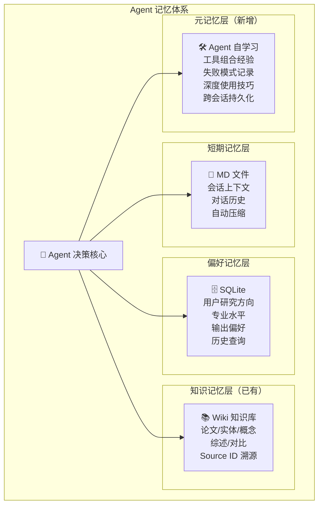
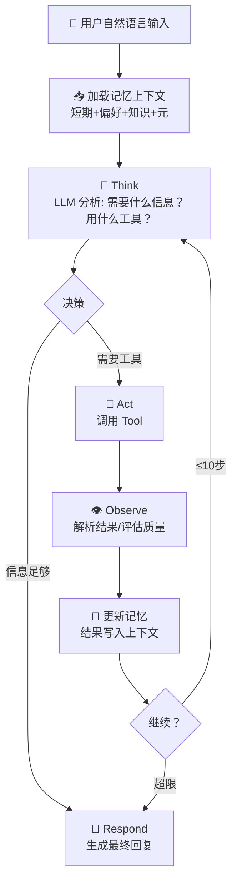

# LLM-Wiki V3 需求分析文档（Agent 架构蓝图）

> **版本**: V3  
> **创建日期**: 2026-05-04  
> **来源**: 用户需求讨论 + V1/V2 架构演进分析  
> **定位**: 从 Wiki 为核心 → Agent 为核心，知识库成为 Agent 的记忆基础设施

---

## 一、V3 核心定位

### 一句话描述

> 从"用户操作知识库"变为"Agent 利用知识库主动服务用户"——Wiki 从产品降级为基础设施，Agent 成为新的一等公民。

### 版本演进全景

```
V1: 📄 单篇论文 → 结构化 Wiki 页面（已完成）
V2: 📚 多篇论文 → 综述 / 对比 / 可视化（规划中）
V3: 🤖 Wiki 知识库 → Agent 的记忆基础设施（蓝图）
```

### 架构范式转变

```
V1/V2 架构:                      V3 架构:
                                  
用户 → Web UI → Pipeline         用户 → Agent 对话 → Agent 循环
                ↓                                     ↓
              知识库（被动）         ┌── Wiki 长期记忆
                                   ├── 短期记忆（MD文件）
                                   ├── 用户偏好（DB）
                                   ├── Tool 层（API→Skill）
                                   └── Agent 自学习记忆
```

---

## 二、记忆体系设计

V3 最核心的创新是建立了**四层记忆体系**，让 Agent 像人一样拥有不同时间尺度的记忆。



### 2.1 短期记忆（会话上下文）

**存储方式**: MD 文件，存项目文件夹 `data/sessions/{session_id}.md`

**内容**:
```markdown
# Session: 2026-05-04-143052

## 对话历史
User: 帮我总结 Chiplet 方向的最新进展
Agent: 正在检索知识库... 找到 12 篇相关论文...
User: 重点关注热管理方面
Agent: 好的，聚焦热管理...

## 当前上下文
- 当前话题: Chiplet 3D 集成热管理
- 已提及实体: TSMC, Apple, MIT CSAIL
- 已使用工具: search_knowledge_base(2次), read_page(3次), compare_papers(1次)
- 待解决问题: 微通道冷却的效率争议

## 自动摘要（当对话超过30轮时自动生成）
本次会话核心需求是 Chiplet 热管理方案综述...
```

**特性**:
- 对话超过 30 轮自动触发 LLM 摘要压缩
- 保留最近 40 条消息 + 摘要作为"压缩记忆"
- 会话结束自动存档，可被后续会话检索引用

---

### 2.2 用户偏好（个人配置）

**存储方式**: SQLite，表 `user_profiles`，按 `user_id` 关联

**Schema**:

```sql
CREATE TABLE user_profiles (
    user_id VARCHAR(50) PRIMARY KEY,
    research_interests TEXT,        -- JSON: ["Chiplet", "RAG", "LLM Reasoning"]
    expertise_level VARCHAR(20),    -- beginner/intermediate/expert
    preferred_output_format VARCHAR(20), -- markdown/json/html
    preferred_detail VARCHAR(20),   -- brief/balanced/detailed
    preferred_language VARCHAR(10), -- zh/en/auto
    recent_queries TEXT,            -- JSON: 最近50条查询及反馈
    created_at DATETIME,
    updated_at DATETIME,
    FOREIGN KEY (user_id) REFERENCES users(id)
);
```

**应用场景**:
- 新手用户 → Agent 自动简化术语解释
- 专家用户 → Agent 直接给技术细节和性能数据
- 根据研究方向偏好 → Agent 优先推荐相关领域的新入库论文

---

### 2.3 知识记忆（Wiki 知识库 — 已有）

V3 不做改动，直接作为 Agent 的"长期记忆"使用：

| 页面类型 | 在 Agent 中的角色 |
|----------|-------------------|
| Paper 页面 | "事实记忆" — 论文的完整知识 |
| Entity 页面 | "人物/机构记忆" — 谁做了什么 |
| Concept 页面 | "概念记忆" — 某个思想的完整解释 |
| Synthesis 页面 | "综合记忆" — V2 生成的综述/对比 |
| Summary 页面 | "摘要记忆" — 快速回顾入口 |

**Agent 访问方式**: 通过 Tool 层调用（search_knowledge_base, read_page 等）

---

### 2.4 Agent 自学习记忆（元记忆 — V3 最大创新）

**存储方式**: 专用 MD 文件 `data/agent_memory/knowledge.md` + `data/agent_memory/tools/*.md`

这是 Agent 对自己"如何更好工作"的记忆，是真正的 meta-learning。

**结构**:

```
data/agent_memory/
├── knowledge.md           # Agent 的知识经验积累
├── tools/
│   ├── search_knowledge_base.md   # 搜索工具使用经验
│   ├── compare_papers.md          # 对比工具使用经验
│   └── generate_survey.md         # 综述工具使用经验
├── patterns/
│   ├── effective_combinations.md  # 工具组合模式
│   └── failure_modes.md           # 已知失败模式及规避方法
└── domain/
    ├── chiplet_expertise.md       # Chiplet 领域深度知识
    └── rag_expertise.md           # RAG 领域深度知识
```

**内容示例** (`tools/compare_papers.md`):

```markdown
# Tool: compare_papers 使用经验

## 最佳实践
- 对比 PDF 提取方案时，维度应包括"表格保留率"（上次遗漏导致对比不完整）
- 性能数据应区分"论文声称值"和"独立复现值"
- 对于没有直接可比数据的维度，标注"无数据"而非猜测

## 常见失败模式
- FAIL-20260504-001: 对比对象超过 5 个时，LLM 生成质量下降 → 分批对比
- FAIL-20260504-002: 跨语言论文对比时，术语翻译不一致 → 先统一术语表

## 有效维度列表（已验证）
1. 准确性（用论文报告的 % 指标）
2. 处理速度（pages/min）
3. 公式保留率（含复杂数学的情况）
4. 表格保留率（含复杂表格的情况）
5. 图片/图表提取质量
6. 多语言支持
7. 部署复杂度
8. 内存占用

## 与其它工具的组合
- compare_papers + generate_survey: 先对比各方案，再将对比结果融入综述
```

**Agent 如何使用这些记忆**:
1. 每次工具调用后，Agent 自动评估效果并记录
2. 遇到类似任务时，Agent 先查自己的能力记忆
3. 某类任务失败 3 次后，Agent 主动标记"能力边界"并告知用户

---

## 三、Tool 层设计（API → Skill）

### 3.1 设计原则

> 不做抽象层的抽象。Tool 就是对已有能力的零依赖封装。

借鉴 Hermes/OpenAI function calling 格式，自建 Tool 注册表。

### 3.2 Tool 清单（初版 12 个）

| Tool | 描述 | 已有依赖 |
|------|------|----------|
| `search_knowledge_base` | 语义搜索知识库，返回相关论文/实体/概念 | ChromaDB |
| `read_page` | 读取指定 Wiki 页面完整内容 | 文件系统 |
| `list_pages` | 列出某类页面（papers/entities/concepts） | 文件系统 |
| `compare_papers` | 对比 2+ 论文在方法/实验/结论上的异同 | LLM + 文件系统 |
| `generate_survey` | 基于知识库生成某方向的综述 | LLM + ChromaDB |
| `find_contradictions` | 查找知识库中互相矛盾的结论 | LLM + 文件系统 |
| `check_health` | 运行系统健康检查 | scripts/lint.py |
| `get_paper_graph` | 获取某论文的引用关系图 | 文件系统 |
| `extract_key_data` | 从论文中提取关键实验数据 | LLM + 文件系统 |
| `summarize_topic` | 快速摘要某话题（轻量版综述） | LLM + ChromaDB |
| `translate_content` | 将 Wiki 内容翻译为指定语言 | LLM |
| `suggest_reading` | 基于用户偏好推荐相关论文 | 用户偏好 + ChromaDB |

### 3.3 Tool 注册表实现

```python
# scripts/tools.py (V3 新增)

from dataclasses import dataclass, field
from typing import Callable, Any

@dataclass
class Tool:
    name: str
    description: str              # LLM 用来判断何时调用
    parameters: dict              # JSON Schema
    fn: Callable                  # 实际执行函数
    usage_count: int = 0          # 使用次数（用于优化排序）
    success_rate: float = 1.0     # 成功率
    avg_latency: float = 0.0      # 平均延迟

class ToolRegistry:
    """Tool 注册表 — 零外部依赖"""
    
    def __init__(self):
        self._tools: dict[str, Tool] = {}
    
    def register(self, tool: Tool):
        self._tools[tool.name] = tool
    
    def get_schemas(self) -> list[dict]:
        """生成 OpenAI/Hermes 兼容的 tool schemas"""
        return [{
            "type": "function",
            "function": {
                "name": t.name,
                "description": t.description,
                "parameters": t.parameters
            }
        } for t in self._tools.values()]
    
    def execute(self, name: str, **kwargs) -> Any:
        tool = self._tools[name]
        result = tool.fn(**kwargs)
        tool.usage_count += 1
        return result
    
    def get_recommended(self, task: str, k: int = 5) -> list[Tool]:
        """基于任务描述和成功率推荐工具"""
        ...
```

---

## 四、Agent 核心循环

### 4.1 设计理念

借鉴 LangGraph 的 StateGraph 思想，但自建实现。核心就一个 ReAct 循环：

```
Think → Act → Observe → Think → Act → Observe → ... → Respond
```

### 4.2 架构图



### 4.3 核心代码（伪代码架构）

```python
# scripts/agent.py (V3 新增, ~200行)

from dataclasses import dataclass, field

@dataclass
class AgentState:
    """Agent 状态 — 借鉴 LangGraph StateGraph"""
    messages: list = field(default_factory=list)
    tool_results: list = field(default_factory=list)
    step_count: int = 0
    max_steps: int = 10
    
    # 记忆引用
    session_id: str = ""
    user_id: str = ""

class Agent:
    """通用 Agent 引擎 — 零 Agent 框架依赖"""
    
    def __init__(
        self,
        tools: ToolRegistry,
        memory: MemoryManager,
        system_prompt: str,
    ):
        self.tools = tools
        self.memory = memory
        self.system_prompt = system_prompt
    
    def run(self, user_input: str, user_id: str) -> str:
        state = AgentState(session_id=self._new_session(), user_id=user_id)
        
        # 加载记忆
        context = self.memory.load_context(user_id, state.session_id)
        
        state.messages = [
            {"role": "system", "content": self.system_prompt},
            *context["short_term"],
            {"role": "system", "content": context["user_profile"]},
            {"role": "system", "content": context["agent_knowledge"]},
            {"role": "user", "content": user_input},
        ]
        
        for _ in range(state.max_steps):
            response = call_llm(
                messages=state.messages,
                tools=self.tools.get_schemas(),
            )
            
            if response.get("content"):
                # Agent 决定直接回复
                self.memory.save_session(state)
                return response["content"]
            
            if tool_calls := response.get("tool_calls"):
                for tc in tool_calls:
                    result = self.tools.execute(
                        tc["function"]["name"],
                        **json.loads(tc["function"]["arguments"])
                    )
                    state.tool_results.append(result)
                    state.messages.append({
                        "role": "tool",
                        "content": json.dumps(result, ensure_ascii=False)
                    })
                    state.step_count += 1
        
        # 达到最大步数 → 基于已有信息生成最佳回复
        return self._force_respond(state)
```

---

## 五、Agent 类型（System Prompt 即 Agent）

不需要代码分叉创建 Agent 类型。同一個 Agent 引擎 + 不同 System Prompt = 不同 Agent。

### 5.1 Agent 目录

| Agent | System Prompt 核心 | 应用场景 |
|-------|-------------------|----------|
| **LiteratureReviewer** | "你是文献审查专家。在知识库中追溯每个主张的来源，发现矛盾结论，输出审查报告含：方法论评价、证据强度等级、研究空白" | 系统性审查某领域的论文质量 |
| **ProductPlanner** | "你是产品策划。基于论文中的用户研究方法和技术方案，输出 PRD/BRD，含：用户画像、功能优先级、技术可行性评估" | 将研究转化为产品方案 |
| **ResearchExplorer** | "你发现研究机会。识别知识库中高频共现但未被直接研究的关系，输出：空白清单、可行性评估、优先级" | 找新研究方向 |
| **Teacher** | "你是教学助手。用知识库论文做例子讲解概念，出思考题，设计学习路径" | 新人培训/自学 |
| **CompetitorAnalyst** | "你分析竞品技术路线。对比各方案的专利/论文/产品化程度，输出竞争格局图" | 技术情报 |
| **WritingAssistant** | "你辅助学术写作。根据用户指定方向，自动检索知识库论文，生成 Related Work 章节，带 Source ID 引用" | 论文写作 |

### 5.2 前端交互形态

V3 前端核心变化：**新增 Agent 对话页面**作为一级入口。

```
V2:                                  V3:
┌──────────┬──────────┐              ┌──────────┬──────────┬──────────┐
│ 导入     │ 知识浏览  │              │ Agent    │ 知识浏览  │ 导入     │
│ (Import) │(Knowledge)│              │ (Chat)   │(Knowledge)│(Import)  │
└──────────┴──────────┘              └──────────┴──────────┴──────────┘
```

Agent 对话页面形态类似 ChatGPT/Claude，但有独特优势：
- Agent 回复中的每条事实标注 Source ID，可点击跳转原文
- 工具调用过程可选展示（类似 Cursor Agent 的透明模式）
- 对话输出可直接"保存为 Wiki 页面"

---

## 六、从 V1/V2 到 V3 的迁移路径

### 6.1 不是推倒重建，而是加一层

```
V2 所有功能和 API 保持不变
         ↓
V3 在 V2 之上叠加:
  ┌─────────────────┐
  │ Agent 对话页面    │ ← V3 新增（前端）
  │ Agent 引擎        │ ← V3 新增（后端）
  │ Tool 注册表       │ ← V3 新增（封装 V1/V2 能力）
  │ 记忆管理器         │ ← V3 新增（4层记忆）
  │ 用户偏好存储       │ ← V3 新增（SQLite）
  └─────────────────┘
         ↓
  ┌─────────────────┐
  │ V1/V2 完整功能    │ ← 保持不变，作为 Tool 的后端
  └─────────────────┘
```

### 6.2 外部依赖策略

| 组件 | 自建/引入 | 理由 |
|------|----------|------|
| Agent 循环 | 自建 (~200行) | 场景具体，通用框架反而增加复杂度 |
| Tool 注册表 | 自建 (~100行) | 借鉴 Hermes function calling 格式 |
| 记忆管理器 | 自建 (~300行) | 4 层记忆与 Wiki 深度耦合，框架做不到 |
| LLM 调用 | 复用 call_llm | 不引入 LangChain |
| 向量搜索 | 复用 ChromaDB | 已有 |
| 用户系统 | 复用 JWT + RBAC | 已有 |

**结论**: 整个 Agent 架构零 Agent 框架依赖。LangChain/LangGraph/CrewAI/AutoGen 都不引入。

---

## 七、竞品差异化分析

| | NotebookLM | ChatGPT + Memory | LLM-Wiki V3 |
|---|---|---|---|
| 知识来源 | 手动上传 | 互联网 + 会话 | **结构化知识库（自建）** |
| 溯源精度 | 段落级 | 无 | **文件级 Source ID** |
| 知识持久化 | 会话内 | 云端不透明 | **本地 Wiki，完全可控** |
| 去重整合 | 无 | 无 | **已有 Merge Pipeline** |
| 质量审核 | 无 | 无 | **Agent_R 5维评分** |
| Agent 自主性 | 无 | 有限 | **Agent 记忆 + 自学习** |
| 部署方式 | SaaS | SaaS | **本地自托管** |

---

## 八、验收标准（V3）

| 维度 | 标准 |
|------|------|
| Agent 对话 | 用户自然语言 → Agent 自动调用 ≥2 种工具 → 返回可溯源的答案 |
| 记忆持久性 | 跨会话：Agent 记住用户研究方向偏好；工具使用经验跨会话积累 |
| 工具执行力 | 10 步内完成用户请求，超限时基于已有信息返回最佳结果 |
| 新增代码量 | Agent 核心 ≤500 行 Python（不重复造轮子） |
| 外部依赖 | **零 Agent 框架依赖** |

---

*本文档基于 2026-05-04 用户需求讨论整理，作为 V3 版本的架构蓝图。V3 的具体开发计划将在 V2 收尾后细化。*
