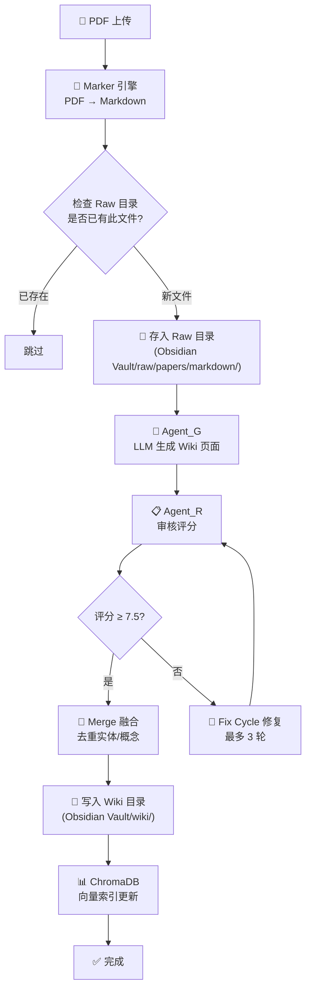
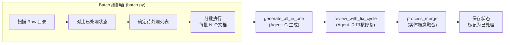
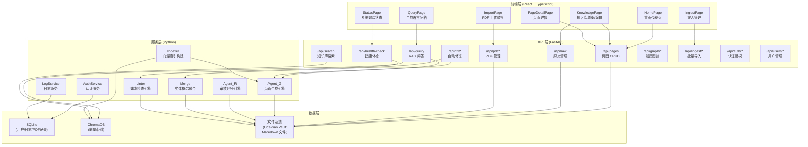

# LLM-Wiki 系统架构文档

> **版本**: V1  
> **最后更新**: 2026-05-03

---

## 一、系统总览

LLM-Wiki 是一个基于 Karpathy LLM-Wiki 理念的知识编译系统，将 PDF 论文自动转化为结构化 Wiki 页面，包含论文精要、提取的实体和概念，并支持融合去重与周期性审核。

```
┌─────────────────────────────────────────────────────────────────┐
│                        LLM-Wiki v3 知识编译系统                    │
├─────────────────────────────────────────────────────────────────┤
│  ┌──────────┐   ┌──────────┐   ┌──────────┐   ┌──────────┐    │
│  │  PDF导入  │ → │ PDF→MD   │ → │ LLM生成  │ → │ 审核修复  │    │
│  │ (上传/管理) │   │ (Marker) │   │ (Agent_G)│   │ (Agent_R)│    │
│  └──────────┘   └──────────┘   └──────────┘   └──────────┘    │
│                                       ↓                         │
│  ┌──────────┐   ┌──────────┐   ┌──────────┐   ┌──────────┐    │
│  │ 知识问答  │ ← │ 向量搜索  │ ← │ 实体融合  │ ← │ 结构输出  │    │
│  │ (RAG)    │   │ (ChromaDB)│   │ (Merge)  │   │ (Wiki页面)│    │
│  └──────────┘   └──────────┘   └──────────┘   └──────────┘    │
├─────────────────────────────────────────────────────────────────┤
│  ┌──────────────────────────────────────────────────────────┐   │
│  │                    系统健康体检 (Lint)                     │   │
│  │  孤儿页面 | 断裂链接 | 重复实体 | 不完整论文 | 缺少概念    │   │
│  └──────────────────────────────────────────────────────────┘   │
└─────────────────────────────────────────────────────────────────┘
```

---

## 二、核心管道流程

> 以下展示一篇新论文从 PDF 到 Wiki 页面的完整生命周期。

### 2.1 录入流程



### 2.2 批量处理流程



---

## 三、模块依赖关系



---

## 四、目录结构

```
e:\ragtest/
├── api/                        # 后端 API
│   ├── main.py                 # FastAPI 应用入口（路由注册）
│   ├── database.py             # 数据库连接与模型基类
│   ├── routers/                # API 路由模块
│   │   ├── auth.py             # 登录/注册/登出
│   │   ├── users.py            # 用户管理（管理员）
│   │   └── logs.py             # 日志查询
│   ├── models/                 # 数据库模型
│   │   ├── user.py             # 用户表
│   │   └── log.py              # 日志表
│   ├── schemas/                # Pydantic 请求/响应模型
│   │   ├── user.py             # 用户 schema
│   │   └── log.py              # 日志 schema
│   ├── services/               # 业务服务层
│   │   ├── auth.py             # 认证逻辑
│   │   └── log_service.py      # 日志记录服务
│   └── middleware/             # 中间件
│       └── auth.py             # JWT 验证与角色授权
│
├── scripts/                    # 核心处理脚本
│   ├── config_loader.py        # 配置加载器（读取 config.yaml）
│   ├── agent_g.py              # Agent_G：LLM 页面生成引擎
│   ├── review.py               # Agent_R：审核评分引擎
│   ├── merge.py                # 实体/概念融合去重
│   ├── batch.py                # Phase 4 批量处理编排
│   ├── lint.py                 # 系统健康体检
│   ├── indexer_simple.py       # ChromaDB 索引构建（简化版）
│   ├── qmd_search_simple.py    # 混合搜索（向量+关键词）
│   └── pdf_converter.py        # PDF → Markdown 转换
│
├── web/                        # 前端
│   ├── src/
│   │   ├── App.tsx             # 路由配置
│   │   ├── pages/              # 页面组件
│   │   ├── components/         # 通用组件
│   │   ├── layouts/            # 布局组件
│   │   ├── services/           # API 调用服务
│   │   ├── stores/             # Zustand 状态管理
│   │   └── utils/              # 工具函数
│   └── vite.config.ts          # Vite 构建配置
│
├── templates/                  # 页面生成模板
│   ├── paper.md                # 论文页模板
│   ├── entity.md               # 实体页模板
│   ├── concept.md              # 概念页模板
│   ├── summary.md              # 摘要页模板
│   └── synthesis.md            # 综合页模板
│
├── config.yaml                 # 系统配置文件
├── requirements.txt            # Python 依赖
├── start-dev.bat               # 开发模式一键启动
├── batch_state.json            # 批量处理状态持久化
│
├── docs/                       # 文档目录
│   ├── architecture.md         # 系统架构文档（本文）
│   ├── api-reference.md        # API 业务语义文档
│   ├── deployment.md           # 部署文档
│   └── CHANGELOG_*.md          # 变更日志
│
├── data/                       # 数据库文件
│   └── llm_wiki.db             # SQLite 数据库
│
└── index/                      # ChromaDB 索引
    └── chroma/                 # 向量数据持久化
```

---

## 五、数据流详解

### 5.1 写路径（PDF → Wiki 页面）

```
PDF 文件
  │
  ▼ (用户上传 /api/pdf/upload)
存入 data/pdfs/
  │
  ▼ (调用 convert_pdf_to_markdown)
Marker 引擎解析 → Raw Markdown
  │
  ▼ (存入 Obsidian Vault)
raw/papers/markdown/{arxiv_id}.md
  │
  ▼ (Agent_G call_llm)
LLM 分析 Raw 内容 → 生成:
  ├── papers/{arxiv_id}_论文.md      (论文精要页)
  ├── entities/{实体名}.md           (提取的实体)
  └── concepts/{概念名}.md           (提取的概念)
  │
  ▼ (Agent_R 审核)
5 维度评分 → 通过(≥7.5) 或 修复重试
  │
  ▼ (Merge 融合)
检查是否有同名实体/概念 → 去重合并
  │
  ▼ (写入 Obsidian Vault)
wiki/papers/ | wiki/entities/ | wiki/concepts/
  │
  ▼ (ChromaDB 增量索引)
更新向量搜索索引
```

### 5.2 读路径（用户查询 → 答案）

```
用户提问
  │
  ▼ (/api/query)
意图识别 → 关键词提取
  │
  ▼ (混合搜索)
├── 向量搜索 (ChromaDB) → 语义相关 Top-K
└── 关键词搜索 (BM25) → 精确匹配 Top-K
  │
  ▼ (结果融合去重)
├── 向量结果 × 0.7
└── 关键词结果 × 0.3
  │
  ▼ (LLM 总结)
根据 Top 上下文生成回答 + 来源引用
  │
  ▼
返回: { answer, sources, related_questions }
```

### 5.3 健康检查路径

```
触发 (/api/health-check)
  │
  ▼ (WikiLinter)
├── Layer 1: 规则检查
│   ├── 孤儿页面 (未被引用的页面)
│   ├── 断裂链接 (目标不存在的 wiki 链接)
│   ├── Frontmatter 完整性
│   ├── 论文结构完整性
│   └── 重复实体检测
│
└── Layer 2: LLM 深度检查
    ├── 缺少概念页面建议
    └── 低质量页面抽样审核
  │
  ▼
返回: { summary, stats, issues, details }
```

---

## 六、外部依赖

| 服务 | 用途 | 备注 |
|------|------|------|
| DeepSeek API | LLM 推理（生成/审核/问答） | 通过 OpenAI 兼容接口调用 |
| HuggingFace | 嵌入模型下载 | 已配置国内镜像 |
| ChromaDB | 向量存储与检索 | 嵌入式运行，无需单独部署 |
| Obsidian Vault | Markdown 文件存储 | 本地文件系统 |

---

## 七、安全架构

```
                    请求进入
                       │
                       ▼
              ┌─────────────────┐
              │  CORS 白名单检查  │  ← 仅允许 localhost:5173/5174
              └────────┬────────┘
                       │
                       ▼
              ┌─────────────────┐
              │  JWT Token 验证  │  ← Bearer Token 解析
              └────────┬────────┘
                       │
                       ▼
              ┌─────────────────┐
              │  角色授权检查    │  ← admin > maintainer > core > general
              └────────┬────────┘
                       │
                       ▼
              ┌─────────────────┐
              │  路径遍历防护    │  ← _safe_path() 阻止目录穿越
              └────────┬────────┘
                       │
                       ▼
              ┌─────────────────┐
              │  XSS 输入过滤    │  ← DOMPurify 前端 + 后端校验
              └────────┬────────┘
                       │
                       ▼
                    业务处理
```

---

*本文档随系统迭代更新，最新版本以代码仓库为准。*
